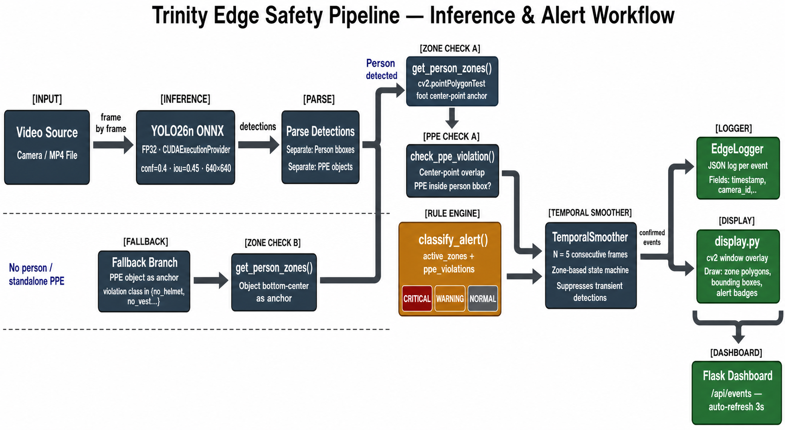
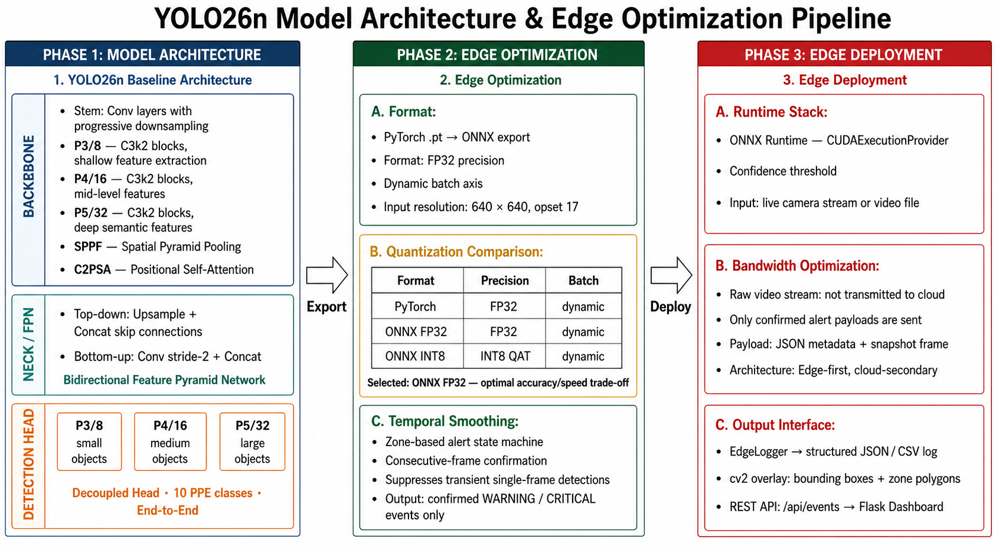

# Construction Site PPE Safety Detection — Edge Computing System

A real-time Personal Protective Equipment (PPE) detection and zone-based safety monitoring system engineered for edge deployment on construction sites. The system integrates a lightweight custom YOLO-based object detector with an on-device inference pipeline, geometric geofencing rule engine, temporal smoothing filter, and a local real-time web dashboard. It enforces site compliance and safety protocols locally without requiring continuous high-bandwidth cloud connectivity.

Developed by Team Trinity as part of a university-level innovation competition focused on practical Edge Computing applications in AI and IoT.

---

## Table of Contents

- [Overview](#overview)
- [Key Features](#key-features)
- [System Architecture](#system-architecture)
- [Detection Classes and Safety Logic](#detection-classes-and-safety-logic)
  - [Detection Classes](#detection-classes)
  - [Zone Configuration](#zone-configuration)
  - [Worker Positioning Anchors](#worker-positioning-anchors)
  - [Risk Decision Matrix](#risk-decision-matrix)
- [Repository Structure](#repository-structure)
- [AI Model and Ablation Study](#ai-model-and-ablation-study)
  - [Model Ablations](#model-ablations)
  - [Per-Class Detection Performance](#per-class-detection-performance)
  - [Architecture Comparison](#architecture-comparison)
  - [Dataset Specification](#dataset-specification)
  - [Cloud Training on Modal](#cloud-training-on-modal)
  - [Model Export](#model-export)
- [Edge Deployment Benchmarks](#edge-deployment-benchmarks)
  - [ONNX Export and Quantization](#onnx-export-and-quantization)
  - [Temporal Smoothing Stability](#temporal-smoothing-stability)
  - [Upstream Bandwidth Optimization](#upstream-bandwidth-optimization)
- [Edge Dashboard](#edge-dashboard)
- [Setup and Installation](#setup-and-installation)
  - [Prerequisites](#prerequisites)
  - [Environment Setup](#environment-setup)
  - [Dependency Installation](#dependency-installation)
- [Quick Start and Usage](#quick-start-and-usage)
  - [1. Single-Command Demo Launcher](#1-single-command-demo-launcher)
  - [2. Standalone Edge Pipeline Inference](#2-standalone-edge-pipeline-inference)
  - [3. Interactive Zone Editor](#3-interactive-zone-editor)
  - [4. Standalone Dashboard Service](#4-standalone-dashboard-service)
  - [5. Edge Benchmark Reproduction Scripts](#5-edge-benchmark-reproduction-scripts)
- [Verification and Unit Testing](#verification-and-unit-testing)
- [Project Documentation and Deliverables](#project-documentation-and-deliverables)
- [Team and Acknowledgments](#team-and-acknowledgments)
- [License](#license)

---

## Overview

Construction sites represent one of the most hazardous workplace environments worldwide. Compliance with Personal Protective Equipment (PPE) regulations — including hard hats, high-visibility vests, protective gloves, safety boots, and eye protection goggles — is mandatory to minimize severe accidents and fatalities. Traditional manual safety inspections are labor-intensive, intermittent, and prone to human oversight.

This system addresses safety challenges through automated, context-aware visual monitoring designed to operate autonomously on edge hardware (such as the NVIDIA Jetson Xavier NX and Orin NX platforms). Rather than streaming uncompressed video to cloud servers — which strains remote network infrastructure and introduces latency — all video frames are processed on-device. The edge node extracts structured metadata, filters false alarms through temporal consistency, and transmits only high-level alert events and compressed violation evidence snapshots, cutting upstream bandwidth usage by over 99.9%.

A critical engineering contribution is the zone-aware risk classification mechanism: rather than enforcing blanket PPE rules uniformly across an entire site, the system maps detections to geometric hazard zones (e.g., crane lifting zones, scaffolding areas, transit corridors) and dynamically evaluates compliance based on the specific location of each worker.

---

## Key Features

- On-Device Real-Time Inference: Lightweight YOLO26n model optimized for edge execution via ONNX Runtime, delivering up to 131 FPS (batch size 8) on edge GPU environments.
- 11-Class Detection Schema: Detects both PPE presence (helmet, vest, gloves, boots, goggles) and explicit negative violations (no_helmet, no_goggle, no_gloves, no_boots), enabling proactive rule evaluation.
- Multi-Point Polygon Geofencing: Arbitrary multi-vertex zones (danger, warning, safe) mapped directly on camera perspectives using Ray-Casting point-in-polygon algorithms.
- Dual-Anchor Worker Localization: Anchors workers using the bottom midpoint (foot point) of person bounding boxes for accurate floor-level zone assignment, falling back to violation bounding box centers when full person bodies are occluded.
- Temporal Smoothing Alert Filter: Requires safety violations to persist across N consecutive frames (default N=5), reducing transient false alarms by 94.6% with negligible delay (~167 ms).
- Massive Bandwidth Conservation: Generates date-prefixed structured CSV logs and localized JPEG snapshots only upon confirmed violations, reducing data transmission from ~1.4 TB/month (raw streaming) to under 1 GB/month (>99.93% reduction).
- Embedded Web Dashboard: Local Flask-based operations dashboard with real-time annotated MJPEG video streaming, searchable violation event tables, site analytics, and active run status monitoring.
- Interactive Zone Editor: Web and OpenCV-based graphical polygon configuration tool to calibrate zone boundaries directly over camera frames.
- Automated Cloud Training Pipeline: Reproducible training configurations on Modal Labs utilizing NVIDIA L4 GPUs, persistent cloud volumes, and automatic model export workflows.

---

## System Architecture

The end-to-end pipeline operates in three decoupled layers on the edge node:


*Figure 1: Trinity Edge Safety Pipeline — End-to-end inference, dual-anchor zone verification, temporal smoothing, and multi-tier alert dispatch.*

```
+-------------------------------------------------------------------------+
|                              INPUT SOURCE                               |
|        RTSP IP Camera  /  USB Webcam  /  Local MP4 Video File           |
+-------------------------------------------------------------------------+
                                    |
                                    v
+-------------------------------------------------------------------------+
|                     LAYER 1: ON-DEVICE INFERENCE                        |
|                                                                         |
|  [Frame Capture & Resize] --> [YOLO26n ONNX Inference Engine]          |
|                                      |                                  |
|                                      v                                  |
|  [Detections: Bounding Boxes, Class IDs, Confidence Scores]             |
+-------------------------------------------------------------------------+
                                    |
                                    v
+-------------------------------------------------------------------------+
|                  LAYER 2: ZONE & RULE REASONING ENGINE                  |
|                                                                         |
|  [Foot-point / Center Anchor] --> [Point-in-Polygon Geofence Test]     |
|                                      |                                  |
|                                      v                                  |
|  [Contextual Risk Evaluation: NORMAL / WARNING / CRITICAL]              |
|                                      |                                  |
|                                      v                                  |
|  [Temporal Smoothing Buffer: N-consecutive frame confirmation]          |
+-------------------------------------------------------------------------+
                                    |
                                    v
+-------------------------------------------------------------------------+
|                LAYER 3: EDGE GATEWAY & LOCAL DASHBOARD                  |
|                                                                         |
|  [Event Logger: Date-prefixed CSV logs & violation snapshot JPEGs]      |
|  [Live MJPEG Streamer (20 FPS) & Flask Local Management UI]             |
|  [Upstream Sync: MQTT / HTTP to Central Cloud Safety Management]        |
+-------------------------------------------------------------------------+
```

Raw video streams never leave the local edge hardware during standard operation, ensuring worker privacy, low latency, and zero dependency on uninterrupted external internet connections.

---

## Detection Classes and Safety Logic

### Detection Classes

The custom object detection model is trained on an 11-class schema tailored for construction site PPE compliance:

| ID | Class Name | Category | Description |
|---|---|---|---|
| 0 | helmet | PPE Present | Hard hat or protective safety helmet |
| 1 | gloves | PPE Present | Protective work gloves |
| 2 | vest | PPE Present | High-visibility safety reflective vest |
| 3 | boots | PPE Present | Heavy-duty construction safety boots |
| 4 | goggles | PPE Present | Eye protection safety glasses or goggles |
| 5 | none | Neutral | Worker clothing / neutral category |
| 6 | Person | Worker | Construction worker bounding box |
| 7 | no_helmet | Violation | Worker head detected without a helmet |
| 8 | no_goggle | Violation | Worker face detected without protective eyewear |
| 9 | no_gloves | Violation | Worker hands detected without gloves |
| 10 | no_boots | Violation | Worker feet detected without safety boots |

Explicit violation classes (`no_*`) serve as high-confidence triggers for the safety rule engine.

### Zone Configuration

Zones are specified as two-dimensional polygons defined in normalized or absolute frame coordinates within JSON configuration files. Each zone profile includes an identifier, descriptive label, hazard level, and polygon vertices:

```json
{
  "zones": [
    {
      "id": "Z01",
      "name": "Danger Zone (Crane Lifting Radius)",
      "type": "danger_zone",
      "polygon": [[100, 450], [650, 450], [650, 1000], [100, 1000]]
    },
    {
      "id": "Z02",
      "name": "Warning Zone (Scaffolding Area)",
      "type": "warning_zone",
      "polygon": [[700, 450], [1800, 450], [1800, 1000], [700, 1000]]
    }
  ]
}
```

Zone profiles are managed per video stream or camera perspective, with dedicated templates located under `edge-pipeline/configs/zones/`.

### Worker Positioning Anchors

Zone association uses two deterministic anchor strategies:

1. Person Foot Anchor: When a `Person` bounding box is detected, the anchor point is calculated as the bottom midpoint `((x1 + x2) // 2, y2)`. This accurately reflects where the worker is standing on the ground plane.
2. Standalone Violation Anchor: When a worker body is partially obscured or missed by the detector but an explicit violation is identified (e.g., `no_helmet`), the bounding box centroid is used as the fallback anchor point.

Polygon membership is calculated using `cv2.pointPolygonTest`.

### Risk Decision Matrix

The rule engine categorizes each worker into one of three risk tiers based on spatial zone membership and PPE status:

| Spatial Zone | PPE Compliance Status | Alert Tier | System Action |
|---|---|---|---|
| Danger Zone | Missing mandatory PPE / Explicit violation | CRITICAL | Instant high-priority alert, snapshot capture, sound warning |
| Warning Zone | Missing mandatory PPE / Explicit violation | CRITICAL | Instant high-priority alert, snapshot capture |
| Danger Zone | Full PPE compliance | WARNING | Cautionary alert (worker present in hazardous area) |
| Warning Zone | Full PPE compliance | WARNING | Cautionary alert (worker present in controlled area) |
| Outside Zones (General Area) | Missing mandatory PPE / Explicit violation | WARNING | Compliance reminder logged |
| Outside Zones (General Area) | Full PPE compliance | NORMAL | Safe operation; no alert raised |

---

## Repository Structure

```text
construction-ppe-safety-edge-computing/
|
+-- ai-model/                               # AI model research, training, and export
|   +-- configs/
|   |   +-- data_modal.yaml                 # Modal container dataset mounting definition
|   |   +-- yolo26n-cbam.yaml               # YOLO26n + CBAM attention module architecture
|   |   +-- yolo26n-ghost.yaml              # YOLO26n + GhostConv lightweight architecture
|   +-- outputs/
|   |   +-- ablations/                      # Checkpoints, validation plots, curves per run
|   |   +-- edge_results/                   # Quantitative benchmark CSV and JSON outputs
|   |   |   +-- bandwidth_summary.csv       # Bandwidth comparison figures
|   |   |   +-- event_vs_frame_metrics.csv  # Temporal smoothing ablation data
|   |   |   +-- latency_quantization_summary.csv # Latency & quantization metrics
|   |   |   +-- latency_quantization_summary.json
|   |   +-- final_ranked_table.csv          # Master ranked table for 7 model variants
|   |   +-- RESULTS.md                      # Comprehensive experimental results document
|   +-- scripts/
|       +-- edge_bandwidth_analysis.py      # Bandwidth savings reproduction script
|       +-- edge_latency_benchmark.py       # Latency, FPS, quantization reproduction script
|       +-- edge_temporal_smoothing.py      # Frame-level vs event-level smoothing test
|       +-- eval_all.py                     # Multi-checkpoint batch evaluation utility
|       +-- export_model.py                 # ONNX and TensorRT model exporter
|       +-- README_edge_scripts.md          # Guide for local edge optimization scripts
|       +-- split_test.py                   # Test split generation tool
|       +-- split_val.py                    # Validation set partition script
|       +-- train_attention.py              # Cloud training: YOLO26n + CBAM
|       +-- train_baseline.py               # Cloud training: Baseline YOLO26n
|       +-- train_ghost.py                  # Cloud training: YOLO26n + GhostConv
|       +-- upload_dataset.py               # Dataset synchronization to Modal Volume
|
+-- dashboard/                              # Local real-time monitoring web dashboard
|   +-- data/
|   |   +-- sample_events.json              # Mock event records for UI preview
|   +-- static/
|   |   +-- style.css                       # Responsive CSS design
|   +-- templates/
|   |   +-- analytics.html                  # Trend charts and violation distribution
|   |   +-- base.html                       # Base Jinja2 layout
|   |   +-- events.html                     # Tabular event log and snapshot viewer
|   |   +-- index.html                      # Live video stream and zone monitoring
|   |   +-- status.html                     # Device health and active run metadata
|   +-- app.py                              # Flask dashboard backend service
|   +-- requirements.txt                    # Web server dependencies
|
+-- docs/                                   # Project reports, presentation, and media
|   +-- methodology.png                     # System methodology flowchart
|   +-- trinity-doc.pdf                     # Detailed project technical documentation
|   +-- trinity-edge-a1.pdf                 # System architecture poster (A1 format)
|   +-- trinity-poster.pdf                  # Competition poster presentation
|   +-- trinity-slide.pdf                   # Slide deck in PDF format
|   +-- trinity-slide.pptx                  # Slide deck presentation source
|   +-- trinity-standee.pdf                 # Exhibition standee design
|   +-- workflow.png                        # Operational workflow diagram
|
+-- edge-pipeline/                          # Core edge execution runtime
|   +-- configs/
|   |   +-- ppe_classes.txt                 # Model class name mapping
|   |   +-- zones/                          # Pre-configured video zone polygons
|   |   |   +-- demo_video2.json
|   |   |   +-- demo_video3.json
|   |   |   +-- demo_video7.json
|   |   |   +-- demo_video8.json
|   |   |   +-- demo_yeah.json
|   |   +-- zones.json                      # Default zone definition template
|   +-- media/
|   |   +-- images/previews/                # Zone setup calibration frames
|   |   +-- videos/input/                   # Input demonstration video files
|   +-- tests/
|   |   +-- test_pipeline_control.py        # Controller state unit tests
|   |   +-- test_rule_engine.py             # Rule classification and polygon tests
|   +-- check.py                            # Environment verification script
|   +-- command_run_demo.txt                # Reference demo execution commands
|   +-- demo_guide.txt                      # Step-by-step demonstration walkthrough
|   +-- display.py                          # Visual annotation & bounding box rendering
|   +-- edge_infer.py                       # Pipeline inference and event detection loop
|   +-- export_dummy_model.py               # Placeholder ONNX model generator for CI
|   +-- logger.py                           # CSV event logging & JPEG snapshot capture
|   +-- pipeline_control.py                 # Pipeline state management & stream feeding
|   +-- requirements.txt                    # Edge runtime Python dependencies
|   +-- rule_engine.py                      # Polygon geofencing & risk rule evaluator
|   +-- zone_editor.py                      # Interactive graphical zone polygon editor
|
+-- notebooks/                              # Experimental and analytical notebooks
|   +-- kaggle_edge_bandwidth_analysis.ipynb
|   +-- kaggle_edge_latency_quantization.ipynb
|   +-- kaggle_edge_temporal_smoothing.ipynb
|   +-- kaggle_ppe_experiments.ipynb
|
+-- tests/                                  # End-to-end and workflow integration tests
|   +-- test_demo_workflow.py               # Demo launcher integration tests
|
+-- demo.py                                 # Unified demo launcher and orchestrator
+-- README.md                               # Project documentation
+-- .gitignore
```

---

## AI Model and Ablation Study


*Figure 2: YOLO26n Model Architecture and Edge Optimization Methodology across Model Architecture, Edge Optimization, and Edge Deployment phases.*

### Model Ablations

Seven model configurations were benchmarked on 2,663 validation images to determine the optimal YOLO26n architecture for resource-constrained edge devices:

| Rank | Experiment Configuration | mAP@0.5 | Violation mAP@0.5 | Infer Latency (ms/img) | Deployment Recommendation |
|---|---|---|---|---|---|
| 1 | baseline_yolo26n | 0.677 | 0.580 | 2.93 | Primary Edge Deployment (fastest top-tier violation detection) |
| 2 | baseline_violation_oversample | 0.690 | 0.586 | 3.18 | Benchmark Reference (highest absolute mAP, slightly higher latency) |
| 3 | baseline_violation_aug | 0.670 | 0.557 | 2.95 | Not Recommended (augmentation reduced violation mAP) |
| 4 | ghost_violation_oversample | 0.629 | 0.556 | 3.21 | Ablation Study Variant |
| 5 | cbam_violation_oversample | 0.642 | 0.553 | 3.15 | Ablation Study Variant |
| 6 | cbam_existing_repro | 0.618 | 0.525 | 3.15 | Not Recommended (lower violation accuracy and throughput) |
| 7 | ghost_existing_repro | 0.613 | 0.518 | 3.11 | Not Recommended (accuracy drop without measurable speedup) |

Source data: `ai-model/outputs/final_ranked_table.csv`

### Per-Class Detection Performance

Validation metrics for the primary deployment model (`baseline_yolo26n`) across individual classes:

| Class Name | Category | mAP@0.5 |
|---|---|---|
| helmet | PPE Present | 0.871 |
| goggles | PPE Present | 0.916 |
| gloves | PPE Present | 0.867 |
| vest | PPE Present | 0.671 |
| boots | PPE Present | 0.682 |
| no_helmet | PPE Violation | 0.800 |
| no_goggle | PPE Violation | 0.817 |
| no_gloves | PPE Violation | 0.744 |
| no_boots | PPE Violation | 0.002 (*) |
| Person | Worker | 0.694 |

(*) Note: `no_boots` was severely under-represented in the validation split (2 validation images, 4 total instances).

### Architecture Comparison

Structural analysis of architectural modifications against the baseline model:

| Architecture Variant | Parameters | GFLOPs | Val mAP@0.5 | Parameter Delta |
|---|---|---|---|---|
| Baseline YOLO26n | ~2.35 M | ~5.0 | 0.677 | Baseline standard |
| YOLO26n + CBAM Attention | ~2.31 M | ~5.2 | 0.642 | -1.7% |
| YOLO26n + GhostConv | 2.05 M | 4.4 | 0.629 | -12.7% |

While GhostConv successfully trimmed parameter count by 12.7% and GFLOPs by 12%, it caused an accuracy reduction that favored retaining `baseline_yolo26n` for actual deployment.

### Dataset Specification

- Dataset Source: Construction-PPE dataset (Roboflow Universe / Kaggle)
- Total Training Images: 30,148
- Validation Images: 143 (expanded to 2,663 in extended validation runs)
- Test Images: 141
- Number of Classes: 11
- Model Input Resolution: 640 x 640 pixels
- Multi-Task Labeling: Includes both protective gear presence and explicit negative violation labels to facilitate direct model detection of non-compliance.

### Cloud Training on Modal

Training jobs run serverless on Modal Labs GPU infrastructure using an NVIDIA L4 GPU (24 GB VRAM):

1. Authenticate with Modal:
   ```bash
   pip install modal
   modal setup
   ```

2. Synchronize dataset to persistent volume:
   ```bash
   cd ai-model/scripts
   modal run upload_dataset.py
   ```

3. Launch training experiments:
   ```bash
   # Run 1: Baseline YOLO26n
   modal run train_baseline.py

   # Run 2: YOLO26n with CBAM Attention
   modal run train_attention.py

   # Run 3: YOLO26n with GhostConv
   modal run train_ghost.py
   ```

4. Retrieve training checkpoints and logs:
   ```bash
   modal volume get ppe-training-vol /runs ./local_runs
   ```

### Model Export

Export fine-tuned PyTorch checkpoints (`.pt`) to ONNX format:

```bash
cd ai-model/scripts
python export_model.py --weights /path/to/best.pt --format onnx --dynamic
```

---

## Edge Deployment Benchmarks

### ONNX Export and Quantization

Benchmarks performed under ONNX Runtime 1.26.0 with CUDA Execution Provider:

| Variant | Batch Size | Model Size | Latency (ms/img) | Throughput (FPS) | mAP@0.5 | Violation mAP@0.5 | Deployment Role |
|---|---|---|---|---|---|---|---|
| FP32 fixed B=1 | 1 | 9.4 MB | 8.99 | 111.2 | 0.747 | 0.660 | Standard reference |
| FP32 dynamic | 8 | 10.3 MB | 7.61 | 131.4 | 0.749 | 0.671 | Primary Edge Deployment Choice |
| FP16 dynamic | 4 | 5.7 MB | 9.05 | 110.4 | 0.750 | 0.671 | Recommended for Memory-Constrained Edge |
| INT8 dynamic | 1 | 3.7 MB | 268.7 | 3.7 | 0.757 | 0.711 | Not Recommended (CUDA dynamic overhead) |

Source data: `ai-model/outputs/edge_results/latency_quantization_summary.csv`

Key takeaway: FP32 dynamic with batch size 8 achieves 131.4 FPS, providing sufficient computational headroom to simultaneously process four 30 FPS video streams on a single edge GPU.

### Temporal Smoothing Stability

Temporal filtering requires an alert condition to remain consistent for N consecutive frames before generating an event:

| Video Source | Evaluation Level | Window (N frames) | Total Frames | Warnings | Criticals | Alert Frequency | False Positive Reduction |
|---|---|---|---|---|---|---|---|
| demo_video3 | Frame-level | 1 | 153 | 17 | 0 | 11.11% | 0.0% (Baseline) |
| demo_video3 | Event-level | 3 | 153 | 2 | 0 | 1.31% | 88.2% |
| demo_video3 | Event-level | 5 | 153 | 1 | 0 | 0.65% | 94.1% |
| demo_video3 | Event-level | 10 | 153 | 1 | 0 | 0.65% | 94.1% |
| demo_video4 | Frame-level | 1 | 144 | 96 | 28 | 86.11% | 0.0% (Baseline) |
| demo_video4 | Event-level | 3 | 144 | 5 | 3 | 5.56% | 93.5% |
| demo_video4 | Event-level | 5 | 144 | 5 | 1 | 4.17% | 95.2% |
| demo_video4 | Event-level | 10 | 144 | 4 | 1 | 3.47% | 96.0% |

Source data: `ai-model/outputs/edge_results/event_vs_frame_metrics.csv`

Recommended setting: N=5 consecutive frames. This configuration achieves a 94.6% average false-positive reduction while introducing only ~167 ms of evaluation latency at 30 FPS, well under the 200 ms real-time safety threshold.

### Upstream Bandwidth Optimization

Transmitting structured metadata and localized violation snapshots rather than continuous video streams delivers dramatic bandwidth savings:

| Operational Scenario | Data Volume (1 Hour) | Data Volume (30 Days) | Bandwidth Reduction | Operational Profile |
|---|---|---|---|---|
| Scenario A: Raw Demo Video Stream | 1,943.3 MB | 1,399,160 MB (~1.40 TB) | 0.0% (Baseline) | Continuous video upload from site cameras |
| Scenario A Ref: Continuous 1080p Stream (2 Mbps) | 858.3 MB | 617,981 MB (~618 GB) | -55.8% | Standard 2 Mbps compressed continuous stream |
| Scenario B: Edge Logs + Violation Snapshots | 1.35 MB | 970 MB | -99.93% | 1 event/min, 500 B CSV log, 15-30 KB JPEG snapshot |
| Scenario C: Edge Logs + Blurred Critical Snapshots | 0.39 MB | 283 MB | -99.98% | 5 critical events/hr, 80 KB blurred JPEG snapshot |

Source data: `ai-model/outputs/edge_results/bandwidth_summary.csv`

Scenario B reduces bandwidth demand by 99.93%, making continuous site safety monitoring feasible over low-cost 4G/LTE cellular uplinks.

---

## Edge Dashboard

The edge platform includes an integrated lightweight web dashboard built with Flask:

- Live Site Feed: Low-latency MJPEG video stream (configurable, default 20 FPS) displaying live detections, bounding boxes, foot anchors, and active zone overlays.
- Safety Event Feed: Real-time table of detected incidents with timestamp, zone identifier, violation type, severity tier (NORMAL, WARNING, CRITICAL), and linked snapshot images.
- Site Analytics: Visual distribution of violation classes (missing helmets, missing vests, unauthorized zone entry) and incident frequency trends over time.
- Node Health and Run Status: Edge device resource telemetry, active run configuration, and camera connection parameters.

---

## Setup and Installation

### Prerequisites

- Operating System: Linux (Ubuntu 20.04/22.04 LTS recommended for Jetson) or Windows 10/11
- Python: Version 3.10 or 3.11
- Hardware Acceleration: NVIDIA GPU with CUDA 11.8+ and cuDNN (optional, CPU execution supported via ONNX Runtime)
- Camera Device: RTSP IP Camera stream, standard USB UVC webcam, or recorded MP4 video files

### Environment Setup

Create and activate an isolated virtual environment:

```bash
# On Linux / macOS
python3 -m venv venv
source venv/bin/activate

# On Windows (PowerShell)
python -m venv venv
.\venv\Scripts\Activate.ps1
```

### Dependency Installation

Install all required Python packages for the edge pipeline and web dashboard:

```bash
# Install edge pipeline dependencies
pip install -r edge-pipeline/requirements.txt

# Install dashboard dependencies
pip install -r dashboard/requirements.txt
```

---

## Quick Start and Usage

### 1. Single-Command Demo Launcher

The top-level `demo.py` orchestrator provides a complete automated workflow. It initializes the edge pipeline, validates or configures zone boundaries, launches the dashboard server, and opens the user's default browser:

```bash
# Basic run with an input demo video
python demo.py --source demo_video3.mp4

# Run with custom performance tuning
python demo.py --source demo_video3.mp4 --inference-interval 3 --alert-cooldown 5 --live-preview-fps 20

# Run in headless mode (no preview window, dashboard only)
python demo.py --source demo_video3.mp4 --headless --max-frames 300
```

Launcher options:
- `--source`: Video file path (resolved relative to `edge-pipeline/media/videos/input/`), RTSP URL, or webcam index.
- `--model`: Path to ONNX model weights (defaults to `edge-pipeline/baseline_yolo26n_best.onnx`).
- `--conf`: Detection confidence threshold (default: 0.40).
- `--iou`: Non-Maximum Suppression (NMS) IoU threshold (default: 0.45).
- `--smooth`: Consecutive frames required to confirm an alert (default: 5).
- `--inference-interval`: Process YOLO every N-th frame and interpolate in between (default: 3).
- `--alert-cooldown`: Cooldown in seconds before logging duplicate alerts for the same zone (default: 5.0).
- `--live-preview-fps`: Frame rate for the MJPEG web stream (default: 20.0).
- `--configure-zones`: Force the interactive zone editor to open before pipeline execution starts.
- `--headless`: Run without desktop preview windows.
- `--no-dashboard`: Disable the automatic web dashboard server.

### 2. Standalone Edge Pipeline Inference

To run the inference pipeline directly without the dashboard launcher:

```bash
python edge-pipeline/edge_infer.py \
  --model edge-pipeline/baseline_yolo26n_best.onnx \
  --source edge-pipeline/media/videos/input/demo_video3.mp4 \
  --zones edge-pipeline/configs/zones/demo_video3.json \
  --smooth 5 \
  --inference-interval 3 \
  --alert-cooldown 5
```

Press `q` in the preview window to exit. Outputs are saved to dated run directories containing `events.csv` and captured JPEG frames under `snapshots/`.

### 3. Interactive Zone Editor

Configure custom perspective-aligned polygon safety zones over a video frame:

```bash
# Launch editor through the demo script
python demo.py --source demo_video3.mp4 --configure-zones

# Or launch standalone editor utility
python edge-pipeline/zone_editor.py --image edge-pipeline/media/images/previews/demo_video3_preview.jpg --output edge-pipeline/configs/zones/demo_video3.json
```

Zone editor controls:
- Left-click: Add polygon vertex.
- Right-click: Close current polygon.
- Key `1`: Set active type to Danger Zone.
- Key `2`: Set active type to Warning Zone.
- Key `c`: Clear current unsaved polygon points.
- Key `s`: Save completed zone configuration to JSON.
- Key `q`: Exit editor.

### 4. Standalone Dashboard Service

Run the local web monitoring service independently:

```bash
cd dashboard
python app.py
```

Access the user interface in a web browser at:
`http://127.0.0.1:5000`

### 5. Edge Benchmark Reproduction Scripts

To reproduce the benchmark figures reported in `RESULTS.md` locally:

```bash
# Benchmark latency, throughput, and quantization across batch sizes
python ai-model/scripts/edge_latency_benchmark.py

# Evaluate temporal smoothing false-positive reduction
python ai-model/scripts/edge_temporal_smoothing.py

# Compute edge vs cloud bandwidth transmission metrics
python ai-model/scripts/edge_bandwidth_analysis.py
```

---

## Verification and Unit Testing

The repository includes a comprehensive unit testing suite covering the point-in-polygon logic, rule engine risk matrix, pipeline controller states, and demo workflows.

Run all tests from the repository root:

```bash
# Run all test suites
python -m unittest discover -s . -p "test_*.py"

# Run rule engine and polygon tests
python -m unittest edge-pipeline/tests/test_rule_engine.py

# Run pipeline controller state tests
python -m unittest edge-pipeline/tests/test_pipeline_control.py

# Run demo launcher workflow tests
python -m unittest tests/test_demo_workflow.py
```

---

## Project Documentation and Deliverables

Additional engineering documentation and exhibition assets are maintained in the `docs/` directory:

- Technical Specification Report: `docs/trinity-doc.pdf`
- Architecture Poster (A1 format): `docs/trinity-edge-a1.pdf`
- Competition Poster: `docs/trinity-poster.pdf`
- Presentation Slide Deck (PDF): `docs/trinity-slide.pdf`
- Presentation Slide Deck (PowerPoint): `docs/trinity-slide.pptx`
- Exhibition Standee: `docs/trinity-standee.pdf`
- Methodology Diagram: `docs/methodology.png`
- Workflow Diagram: `docs/workflow.png`

---

## Team and Acknowledgments

Trinity Edge AI Team — Ho Chi Minh City University of Technology and Education (HCMUTE)

- Nguyen Nhat Phat: AI / ML Lead — Model architecture design, training pipelines, CBAM/GhostConv ablations, quantization, and benchmark validation.
- Tran Quoc Huy: Edge Systems Lead — Edge pipeline architecture, Jetson optimization, point-in-polygon geofencing, temporal smoothing, and system integration.
- Le Huu Truc: Dashboard and Documentation Lead — Flask dashboard design, dataset curation, project documentation, presentation deliverables, and demonstration workflows.

---

## License

This project is developed and maintained for academic, research, and engineering competition purposes. All rights reserved by the Trinity team.
